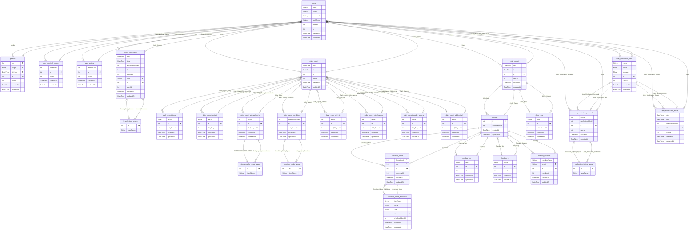

```mermaid
erDiagram

  "users" {
    String email 
    String name 
    String password 
    String authCode 
    Int verified 
    Int id "🗝️"
    DateTime createdAt 
    DateTime updatedAt 
    }
  

  "profiles" {
    Int sex "❓"
    Float height "❓"
    DateTime birthday "❓"
    Int id "🗝️"
    Int userId 
    DateTime createdAt 
    DateTime updatedAt 
    }
  

  "user_medical_history" {
    Int ileostomy 
    Int id "🗝️"
    Int userId 
    DateTime createdAt 
    DateTime updatedAt 
    }
  

  "user_setting" {
    Int themeColor 
    Int id "🗝️"
    Int userId 
    DateTime createdAt 
    DateTime updatedAt 
    }
  

  "bowel_movements" {
    DateTime day 
    DateTime time 
    Int bristolStoolScale 
    Int blood 
    Int drainage 
    String note "❓"
    Int id "🗝️"
    Int userId 
    DateTime createdAt 
    DateTime updatedAt 
    }
  

  "bristol_stool_scales" {
    Int id "🗝️"
    String typeName 
    }
  

  "daily_report" {
    DateTime day 
    DateTime time 
    Int id "🗝️"
    Int userId 
    DateTime createdAt 
    DateTime updatedAt 
    }
  

  "daily_report_temp" {
    Float result 
    Int id "🗝️"
    Int dailyReportId 
    DateTime createdAt 
    DateTime updatedAt 
    }
  

  "daily_report_weight" {
    Float result 
    Int id "🗝️"
    Int dailyReportId 
    DateTime createdAt 
    DateTime updatedAt 
    }
  

  "daily_report_stomachache" {
    Int result 
    Int id "🗝️"
    Int dailyReportId 
    DateTime createdAt 
    DateTime updatedAt 
    }
  

  "stomachache_scale_types" {
    Int id "🗝️"
    String typeName 
    }
  

  "daily_report_condition" {
    Int conditionScaleId 
    Int id "🗝️"
    Int dailyReportId 
    DateTime createdAt 
    DateTime updatedAt 
    }
  

  "condition_scale_types" {
    Int id "🗝️"
    String typeName 
    }
  

  "daily_report_arthritis" {
    Int result 
    Int id "🗝️"
    Int dailyReportId 
    DateTime createdAt 
    DateTime updatedAt 
    }
  

  "daily_report_skin_lesions" {
    Int result 
    Int id "🗝️"
    Int dailyReportId 
    DateTime createdAt 
    DateTime updatedAt 
    }
  

  "daily_report_ocular_lesions" {
    Int result 
    Int id "🗝️"
    Int dailyReportId 
    DateTime createdAt 
    DateTime updatedAt 
    }
  

  "daily_report_abdominal" {
    Int result 
    Int id "🗝️"
    Int dailyReportId 
    DateTime createdAt 
    DateTime updatedAt 
    }
  

  "clinic_report" {
    DateTime day 
    DateTime time 
    Int id "🗝️"
    Int userId 
    DateTime createdAt 
    DateTime updatedAt 
    }
  

  "checkup" {
    Int id "🗝️"
    Int clinicReportId 
    DateTime createdAt 
    DateTime updatedAt 
    }
  

  "checkup_blood" {
    Int hematocrit "❓"
    Int crp "❓"
    Int id "🗝️"
    Int checkupId 
    DateTime createdAt 
    DateTime updatedAt 
    }
  

  "checkup_blood_additional" {
    String itemName 
    String result "❓"
    String unit "❓"
    Int id "🗝️"
    Int checkupBloodId 
    DateTime createdAt 
    DateTime updatedAt 
    }
  

  "checkup_mri" {
    String result 
    Int id "🗝️"
    Int checkupId 
    DateTime createdAt 
    DateTime updatedAt 
    }
  

  "checkup_ct" {
    String result 
    Int id "🗝️"
    Int checkupId 
    DateTime createdAt 
    DateTime updatedAt 
    }
  

  "checkup_custom" {
    String checkupName 
    String result "❓"
    Int id "🗝️"
    Int checkupId 
    DateTime createdAt 
    DateTime updatedAt 
    }
  

  "clinic_note" {
    String note 
    Int id "🗝️"
    Int clinicReportId 
    DateTime createdAt 
    DateTime updatedAt 
    }
  

  "user_medication_info" {
    String name 
    Float count 
    Float dosage 
    Int id "🗝️"
    Int userId 
    DateTime createdAt 
    DateTime updatedAt 
    }
  

  "user_medication_schedule" {
    Int timing 
    Int medicationInfoId 
    Int id "🗝️"
    Int userId 
    DateTime createdAt 
    DateTime updatedAt 
    }
  

  "medication_timing_types" {
    Int id "🗝️"
    String typeName 
    }
  

  "user_medication_result" {
    DateTime day 
    DateTime time 
    Int medicationInfoId 
    Int id "🗝️"
    Int userId 
    DateTime createdAt 
    DateTime updatedAt 
    }
  
    "users" o{--}o "bowel_movements" : "bowelMovement"
    "users" o{--}o "profiles" : "profile"
    "users" o{--}o "user_medical_history" : "User_Medical_History"
    "users" o{--}o "user_setting" : "User_Setting"
    "users" o{--}o "daily_report" : "Daily_Report"
    "users" o{--}o "clinic_report" : "Clinic_Report"
    "users" o{--}o "user_medication_info" : "User_Medication_Info"
    "users" o{--}o "user_medication_schedule" : "User_Medication_Schedule"
    "users" o{--}o "user_medication_result" : "User_Medication_Result"
    "profiles" o|--|| "users" : "user"
    "user_medical_history" o|--|| "users" : "User"
    "user_setting" o|--|| "users" : "User"
    "bowel_movements" o|--|| "bristol_stool_scales" : "Bristol_Stool_Scales"
    "bowel_movements" o|--|| "users" : "User"
    "bristol_stool_scales" o{--}o "bowel_movements" : "Bowel_Movement"
    "daily_report" o{--}o "daily_report_temp" : "Daily_report_Temp"
    "daily_report" o{--}o "daily_report_weight" : "Daily_report_Weight"
    "daily_report" o{--}o "daily_report_stomachache" : "Daily_report_Stomachache"
    "daily_report" o{--}o "daily_report_condition" : "Daily_report_Condition"
    "daily_report" o{--}o "daily_report_arthritis" : "Daily_report_Arthritis"
    "daily_report" o{--}o "daily_report_skin_lesions" : "Daily_report_SkinLesions"
    "daily_report" o{--}o "daily_report_ocular_lesions" : "Daily_report_OcularLesitions"
    "daily_report" o{--}o "daily_report_abdominal" : "Daily_report_Abdominal"
    "daily_report" o|--|| "users" : "User"
    "daily_report_temp" o|--|| "daily_report" : "Daily_Report"
    "daily_report_weight" o|--|| "daily_report" : "Daily_Report"
    "daily_report_stomachache" o|--|| "stomachache_scale_types" : "Stomachache_Scale_Types"
    "daily_report_stomachache" o|--|| "daily_report" : "Daily_Report"
    "stomachache_scale_types" o{--}o "daily_report_stomachache" : "Daily_report_Stomachache"
    "daily_report_condition" o|--|| "condition_scale_types" : "Condition_Scale_Types"
    "daily_report_condition" o|--|| "daily_report" : "Daily_Report"
    "condition_scale_types" o{--}o "daily_report_condition" : "Daily_report_Condition"
    "daily_report_arthritis" o|--|| "daily_report" : "Daily_Report"
    "daily_report_skin_lesions" o|--|| "daily_report" : "Daily_Report"
    "daily_report_ocular_lesions" o|--|| "daily_report" : "Daily_Report"
    "daily_report_abdominal" o|--|| "daily_report" : "Daily_Report"
    "clinic_report" o{--}o "checkup" : "Checkup"
    "clinic_report" o{--}o "clinic_note" : "Clinic_Note"
    "clinic_report" o|--|| "users" : "User"
    "checkup" o{--}o "checkup_blood" : "Checkup_Blood"
    "checkup" o{--}o "checkup_mri" : "Checkup_Mri"
    "checkup" o{--}o "checkup_ct" : "Checkup_Ct"
    "checkup" o{--}o "checkup_custom" : "Checkup_Custom"
    "checkup" o|--|| "clinic_report" : "Clinic_Report"
    "checkup_blood" o{--}o "checkup_blood_additional" : "Checkup_Blood_Additional"
    "checkup_blood" o|--|| "checkup" : "Checkup"
    "checkup_blood_additional" o|--|| "checkup_blood" : "Checkup_Blood"
    "checkup_mri" o|--|| "checkup" : "Checkup"
    "checkup_ct" o|--|| "checkup" : "Checkup"
    "checkup_custom" o|--|| "checkup" : "Checkup"
    "clinic_note" o|--|| "clinic_report" : "Clinic_Report"
    "user_medication_info" o|--|| "users" : "User"
    "user_medication_info" o{--}o "user_medication_schedule" : "User_Medication_Schedule"
    "user_medication_info" o{--}o "user_medication_result" : "User_Medication_Result"
    "user_medication_schedule" o|--|| "medication_timing_types" : "Medication_Timing_Types"
    "user_medication_schedule" o|--|| "user_medication_info" : "User_Medication_Info"
    "user_medication_schedule" o|--|| "users" : "User"
    "medication_timing_types" o{--}o "user_medication_schedule" : "User_Medication_Schedule"
    "user_medication_result" o|--|| "user_medication_info" : "User_Medication_Info"
    "user_medication_result" o|--|| "users" : "User"
```
