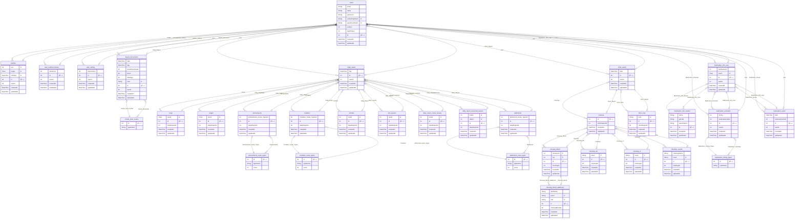

```mermaid
erDiagram

  "users" {
    String email 
    String name 
    String password 
    String verifyEmailHash "â“"
    String passResetHash "â“"
    Int verified 
    Int loginStatus 
    Int id "ğŸ—ï¸"
    DateTime createdAt 
    DateTime updatedAt 
    }
  

  "profiles" {
    Int sex "â“"
    Float height "â“"
    DateTime birthday "â“"
    Int id "ğŸ—ï¸"
    Int userId 
    DateTime createdAt 
    DateTime updatedAt 
    }
  

  "user_medical_history" {
    Int ileostomy 
    Int id "ğŸ—ï¸"
    Int userId 
    DateTime createdAt 
    DateTime updatedAt 
    }
  

  "user_setting" {
    Int themeColor 
    Int id "ğŸ—ï¸"
    Int userId 
    DateTime createdAt 
    DateTime updatedAt 
    }
  

  "bowel_movements" {
    DateTime date 
    DateTime day 
    Int bristolStoolScale 
    Int blood 
    Int drainage 
    String note "â“"
    Int id "ğŸ—ï¸"
    Int userId 
    DateTime createdAt 
    DateTime updatedAt 
    }
  

  "bristol_stool_scales" {
    Int id "ğŸ—ï¸"
    String typeName 
    }
  

  "daily_report" {
    DateTime day 
    Int id "ğŸ—ï¸"
    Int userId 
    DateTime createdAt 
    DateTime updatedAt 
    }
  

  "temp" {
    Float result "â“"
    Int id "ğŸ—ï¸"
    Int dailyReportId 
    DateTime createdAt 
    DateTime updatedAt 
    }
  

  "weight" {
    Float result "â“"
    Int id "ğŸ—ï¸"
    Int dailyReportId 
    DateTime createdAt 
    DateTime updatedAt 
    }
  

  "stomachache" {
    Int stomachache_Scale_TypesId 
    Int id "ğŸ—ï¸"
    Int dailyReportId 
    DateTime createdAt 
    DateTime updatedAt 
    }
  

  "stomachache_scale_types" {
    Int id "ğŸ—ï¸"
    String typeName 
    Int score 
    }
  

  "condition" {
    Int condition_Scale_TypesId 
    Int id "ğŸ—ï¸"
    Int dailyReportId 
    DateTime createdAt 
    DateTime updatedAt 
    }
  

  "condition_scale_types" {
    Int id "ğŸ—ï¸"
    String typeName 
    Int score 
    }
  

  "arthritis" {
    Int result "â“"
    Int id "ğŸ—ï¸"
    Int dailyReportId 
    DateTime createdAt 
    DateTime updatedAt 
    }
  

  "skin_lesions" {
    Int result "â“"
    Int id "ğŸ—ï¸"
    Int dailyReportId 
    DateTime createdAt 
    DateTime updatedAt 
    }
  

  "daily_report_ocular_lesions" {
    Int result "â“"
    Int id "ğŸ—ï¸"
    Int dailyReportId 
    DateTime createdAt 
    DateTime updatedAt 
    }
  

  "daily_report_anorectal_lesions" {
    Int fistula "â“"
    Int others "â“"
    Int id "ğŸ—ï¸"
    Int dailyReportId 
    DateTime createdAt 
    DateTime updatedAt 
    }
  

  "abdominal" {
    Int abdominal_Scale_TypesId 
    Int id "ğŸ—ï¸"
    Int dailyReportId 
    DateTime createdAt 
    DateTime updatedAt 
    }
  

  "abdominal_scale_types" {
    Int id "ğŸ—ï¸"
    String typeName 
    Int score 
    }
  

  "clinic_report" {
    DateTime date 
    Int id "ğŸ—ï¸"
    Int userId 
    DateTime createdAt 
    DateTime updatedAt 
    }
  

  "checkup" {
    Int id "ğŸ—ï¸"
    Int clinicReportId 
    DateTime createdAt 
    DateTime updatedAt 
    }
  

  "checkup_blood" {
    Int hematocrit "â“"
    Int crp "â“"
    Int id "ğŸ—ï¸"
    Int checkupId 
    DateTime createdAt 
    DateTime updatedAt 
    }
  

  "checkup_blood_additional" {
    String itemName 
    String result "â“"
    String unit "â“"
    Int id "ğŸ—ï¸"
    Int checkupBloodId 
    DateTime createdAt 
    DateTime updatedAt 
    }
  

  "checkup_mri" {
    String result "â“"
    Int id "ğŸ—ï¸"
    Int checkupId 
    DateTime createdAt 
    DateTime updatedAt 
    }
  

  "checkup_ct" {
    String result "â“"
    Int id "ğŸ—ï¸"
    Int checkupId 
    DateTime createdAt 
    DateTime updatedAt 
    }
  

  "checkup_custom" {
    String checkupName 
    String result "â“"
    Int id "ğŸ—ï¸"
    Int checkupId 
    DateTime createdAt 
    DateTime updatedAt 
    }
  

  "clinic_note" {
    String note "â“"
    Int id "ğŸ—ï¸"
    Int clinicReportId 
    DateTime createdAt 
    DateTime updatedAt 
    }
  

  "medication_info_user" {
    Int medicationId 
    Float count "â“"
    Int id "ğŸ—ï¸"
    Int userId 
    DateTime createdAt 
    DateTime updatedAt 
    }
  

  "medication_info_master" {
    String name 
    String yjCode 
    String specification 
    Int id "ğŸ—ï¸"
    DateTime createdAt 
    DateTime updatedAt 
    }
  

  "medication_schedule" {
    Int timing 
    Int medicationInfoId 
    Int id "ğŸ—ï¸"
    Int userId 
    DateTime createdAt 
    DateTime updatedAt 
    }
  

  "medication_timing_types" {
    Int id "ğŸ—ï¸"
    String typeName 
    }
  

  "medication_result" {
    DateTime date 
    Int medicationInfoId 
    Int id "ğŸ—ï¸"
    Int userId 
    DateTime createdAt 
    DateTime updatedAt 
    }
  
    "users" o{--}o "bowel_movements" : "Bowel_Movement"
    "users" o{--}o "profiles" : "Profile"
    "users" o{--}o "user_medical_history" : "User_Medical_History"
    "users" o{--}o "user_setting" : "User_Setting"
    "users" o{--}o "daily_report" : "Daily_Report"
    "users" o{--}o "clinic_report" : "Clinic_Report"
    "users" o{--}o "medication_info_user" : "Medication_Info_User"
    "users" o{--}o "medication_schedule" : "Medication_Schedule"
    "users" o{--}o "medication_result" : "Medication_Result"
    "profiles" o|--|| "users" : "user"
    "user_medical_history" o|--|| "users" : "User"
    "user_setting" o|--|| "users" : "User"
    "bowel_movements" o|--|| "bristol_stool_scales" : "Bristol_Stool_Scales"
    "bowel_movements" o|--|| "users" : "User"
    "bristol_stool_scales" o{--}o "bowel_movements" : "Bowel_Movement"
    "daily_report" o{--}o "temp" : "Temp"
    "daily_report" o{--}o "weight" : "Weight"
    "daily_report" o{--}o "stomachache" : "Stomachache"
    "daily_report" o{--}o "condition" : "Condition"
    "daily_report" o{--}o "arthritis" : "Arthritis"
    "daily_report" o{--}o "skin_lesions" : "Skin_Lesions"
    "daily_report" o{--}o "daily_report_ocular_lesions" : "Ocular_Lesitions"
    "daily_report" o{--}o "daily_report_anorectal_lesions" : "Anorectal_Lesitions"
    "daily_report" o{--}o "abdominal" : "Abdominal"
    "daily_report" o|--|| "users" : "User"
    "temp" o|--|| "daily_report" : "Daily_Report"
    "weight" o|--|| "daily_report" : "Daily_Report"
    "stomachache" o|--|| "stomachache_scale_types" : "Stomachache_Scale_Types"
    "stomachache" o|--|| "daily_report" : "Daily_Report"
    "stomachache_scale_types" o{--}o "stomachache" : "Stomachache"
    "condition" o|--|| "condition_scale_types" : "Condition_Scale_Types"
    "condition" o|--|| "daily_report" : "Daily_Report"
    "condition_scale_types" o{--}o "condition" : "Condition"
    "arthritis" o|--|| "daily_report" : "Daily_Report"
    "skin_lesions" o|--|| "daily_report" : "Daily_Report"
    "daily_report_ocular_lesions" o|--|| "daily_report" : "Daily_Report"
    "daily_report_anorectal_lesions" o|--|| "daily_report" : "Daily_Report"
    "abdominal" o|--|| "abdominal_scale_types" : "Abdominal_Scale_Types"
    "abdominal" o|--|| "daily_report" : "Daily_Report"
    "abdominal_scale_types" o{--}o "abdominal" : "Abdominal"
    "clinic_report" o{--}o "checkup" : "Checkup"
    "clinic_report" o{--}o "clinic_note" : "Clinic_Note"
    "clinic_report" o|--|| "users" : "User"
    "checkup" o{--}o "checkup_blood" : "Checkup_Blood"
    "checkup" o{--}o "checkup_mri" : "Checkup_Mri"
    "checkup" o{--}o "checkup_ct" : "Checkup_Ct"
    "checkup" o{--}o "checkup_custom" : "Checkup_Custom"
    "checkup" o|--|| "clinic_report" : "Clinic_Report"
    "checkup_blood" o{--}o "checkup_blood_additional" : "Checkup_Blood_Additional"
    "checkup_blood" o|--|| "checkup" : "Checkup"
    "checkup_blood_additional" o|--|| "checkup_blood" : "Checkup_Blood"
    "checkup_mri" o|--|| "checkup" : "Checkup"
    "checkup_ct" o|--|| "checkup" : "Checkup"
    "checkup_custom" o|--|| "checkup" : "Checkup"
    "clinic_note" o|--|| "clinic_report" : "Clinic_Report"
    "medication_info_user" o|--|| "medication_info_master" : "Medication_Info_Master"
    "medication_info_user" o|--|| "users" : "User"
    "medication_info_user" o{--}o "medication_schedule" : "Medication_Schedule"
    "medication_info_user" o{--}o "medication_result" : "Medication_Result"
    "medication_info_master" o{--}o "medication_info_user" : "Medication_Info_User"
    "medication_schedule" o|--|| "medication_timing_types" : "Medication_Timing_Types"
    "medication_schedule" o|--|| "medication_info_user" : "Medication_Info_User"
    "medication_schedule" o|--|| "users" : "User"
    "medication_timing_types" o{--}o "medication_schedule" : "Medication_Schedule"
    "medication_result" o|--|| "medication_info_user" : "Medication_Info_User"
    "medication_result" o|--|| "users" : "User"
```
